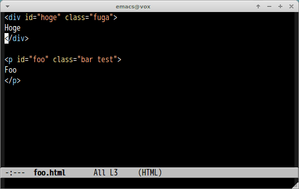

# close-comment-tag.el

Insert comment tag before end tag. Comment tag contain `id` and `class` attributes.
This is Emacs port of [Dreamwearver plugin](http://design.kayac.com/topics/2010/05/dreamweaver-extention.php) and [Sublimetext CloseCommentTag](https://github.com/Satoh-D/CloseCommentTag)

## ScreenCast

## Command

#### `M-x close-comment-tag`

Insert comment tag. This command should be invoked at beginning of end tag.
